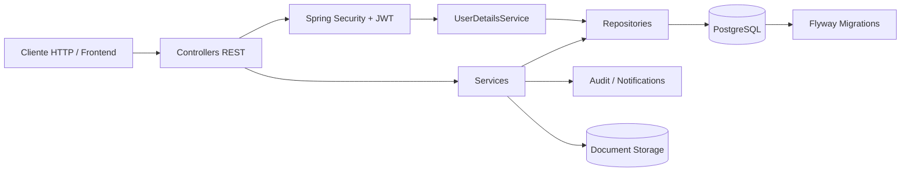
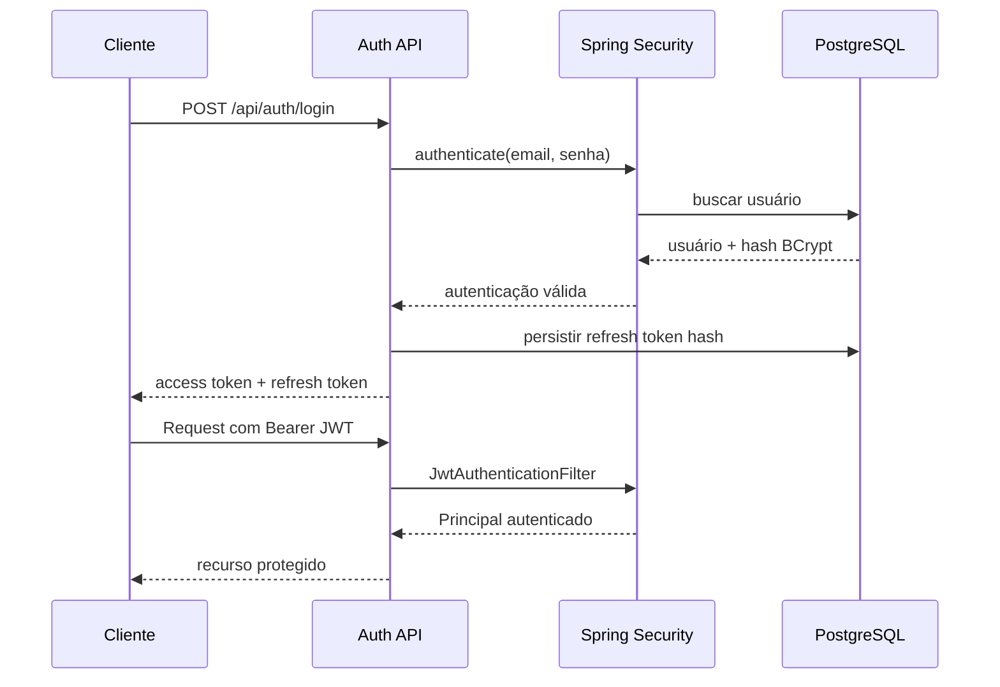

# Arquitetura

## Visão geral

A aplicação segue uma arquitetura modular em camadas, com separação clara entre entrada HTTP, regras de negócio, persistência, segurança e preocupações transversais.



## Organização dos pacotes

```text
com.lawfirm.management
├── config/              # configuração da aplicação
├── security/            # JWT, refresh tokens e handlers de segurança
├── common/
│   ├── audit/           # auditoria transversal
│   └── exception/       # erros e tratamento global
├── user/                # autenticação e usuários
├── client/              # clientes
├── legalcase/           # processos jurídicos
├── deadline/            # prazos
├── appointment/         # agenda
├── notification/        # notificações e scheduler
├── document/            # documentos
└── dashboard/           # indicadores
```

Cada módulo de negócio segue, quando aplicável:

`Controller → Service → Repository`

com `DTO → Mapper → Entity` para evitar expor entidades JPA diretamente na API.

## Decisões importantes

### UUID
IDs são UUIDs para evitar IDs sequenciais previsíveis e facilitar geração distribuída.

### DTOs
Requests e responses são separados das entidades. Isso reduz acoplamento da API ao modelo persistido e evita exposição acidental de campos sensíveis.

### Flyway
O schema é versionado por migrations. Hibernate usa `ddl-auto=validate`, portanto a aplicação valida o schema sem assumir a responsabilidade de criá-lo.

### Segurança
- Access token JWT de curta duração.
- Refresh token opaco, aleatório e armazenado apenas como hash BCrypt.
- Rotação e revogação de refresh tokens.
- BCrypt para senhas.
- Roles `ADMIN`, `ADVOGADO` e `ASSISTENTE`.
- Ownership checks nos recursos jurídicos.
- Sessão stateless.

### Auditoria
Operações relevantes geram registros de auditoria em transação separada (`REQUIRES_NEW`) para que uma falha na auditoria não invalide a operação principal.

### Prazos vencidos
O estado de vencimento é derivado da data atual em vez de persistido como status independente. Isso evita inconsistência entre o relógio real e o banco.

### Concorrência
Entidades que podem sofrer atualizações concorrentes utilizam `@Version` para optimistic locking.

### Documentos
Arquivos são armazenados fora do banco, enquanto metadados, hash SHA-256 e vínculos ficam persistidos no PostgreSQL. Em produção, o storage local deve ser substituído por armazenamento de objetos quando a infraestrutura exigir escala horizontal.

## Fluxo de autenticação



## Fluxo de autorização

Autenticação responde **quem é o usuário**. Autorização responde **o que ele pode fazer**.

Exemplo: um advogado pode consultar processos sob sua responsabilidade, enquanto `ADMIN` possui visão administrativa. O service também valida ownership; a segurança não fica dependente apenas do controller.

## Evolução futura

Para escala maior, os próximos pontos naturais são:

- object storage para documentos;
- Redis para cache e/ou sessões auxiliares;
- fila/event bus para notificações assíncronas;
- observabilidade com métricas, logs estruturados e tracing;
- CI/CD com ambiente de staging;
- migração para Kubernetes somente se a escala justificar.
